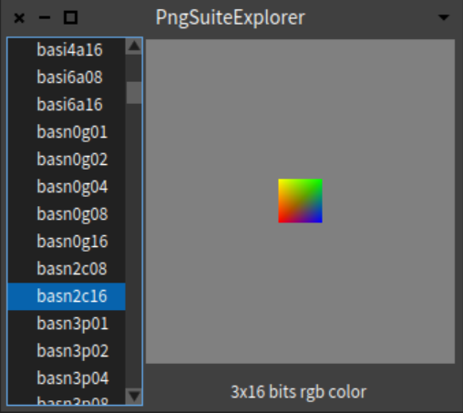

# PngSuiteExplorer



PngSuiteExplorer is a simple tool to test the support for PNG files in Pharo using [the "official" test-suite for PNG](http://www.schaik.com/pngsuite2011). 

# Installation
```smalltalk
Metacello new
   baseline: 'PngSuiteExplorer';
   repository: 'github://DraagrenKirneh/PngSuiteExplorer';
   load.
```

# Usage
```smalltalk
PngSuiteExplorer open
```
